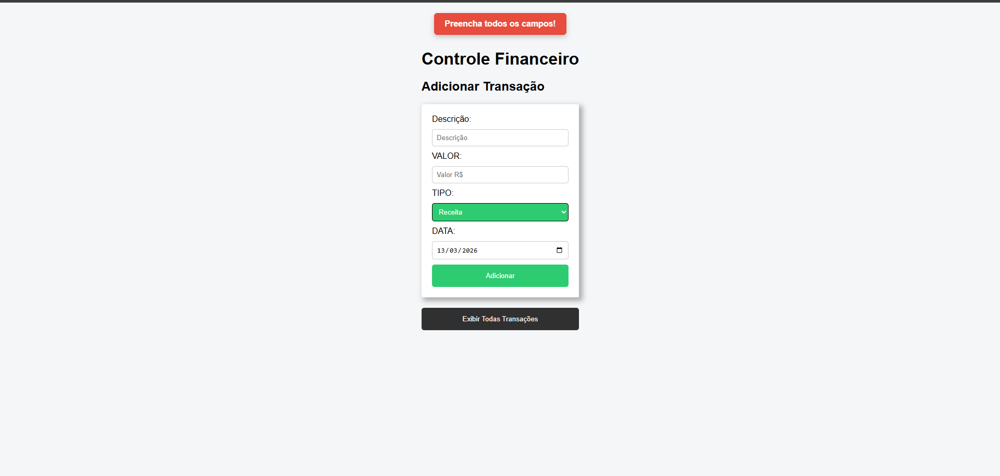
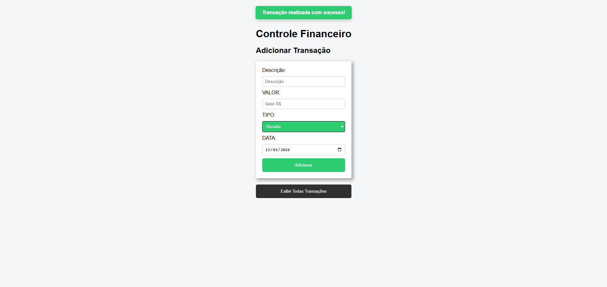
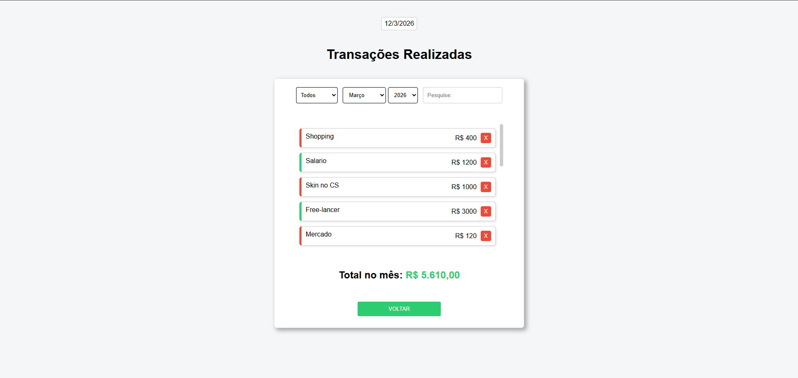
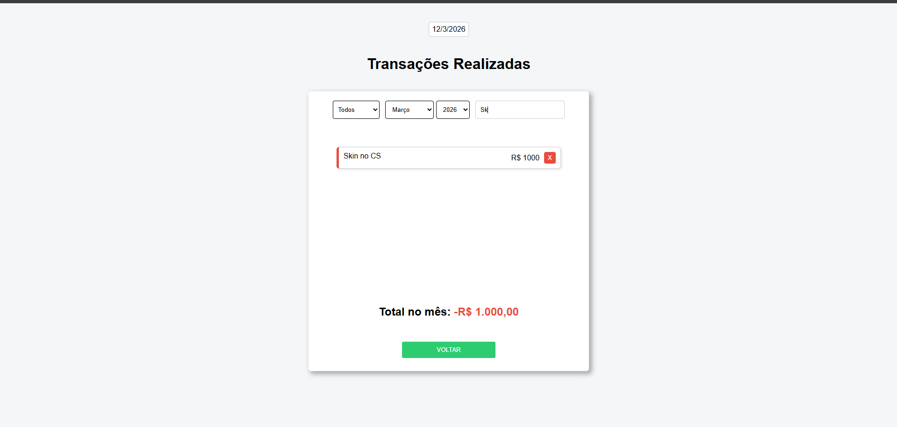
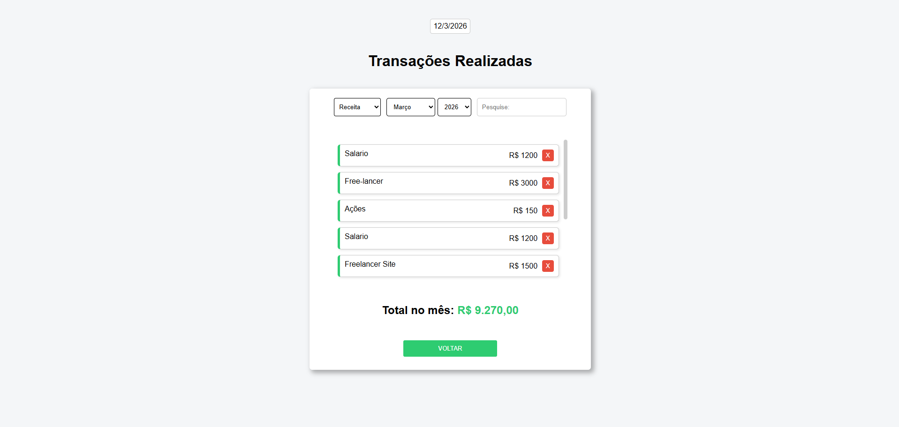
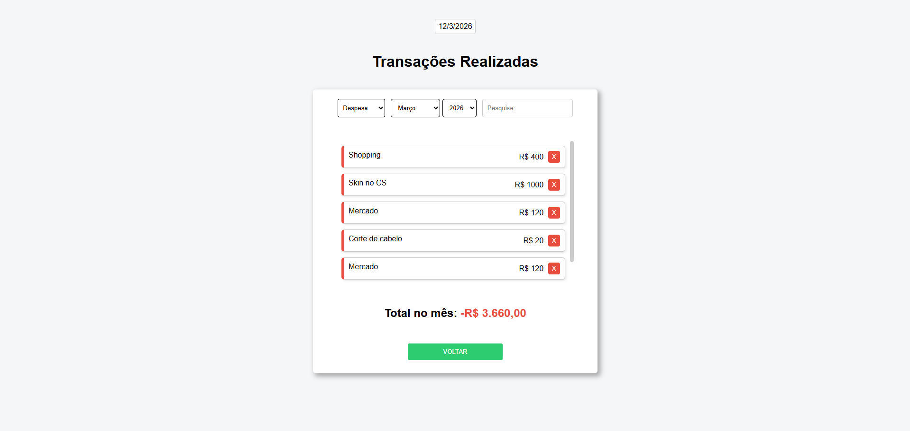

### BackEnd do Projeto: https://github.com/RafaelOlivira/Controle-Financeiro-Back-End

# Controle Financeiro Simples
*Feito por Rafael Oliveira*

## **Sobre o Projeto**:

Um sistema projetado e pensado para facilitar no controle de finanças pessoal

Registrando todas as entradas de receitas e de despesas do usuário.

O sistema traz uma facilidade ao realizar automaticamente contas (Receita - Despesa) 

para um maior entendimento do usuário em relação a saúde financeira do seu lar.

O sistema possui também um mecânismo de buscas personalizadas:

Tipos:
- Todos
- Receita
- Despesa

Período:
- Mês
- Ano

Busca pela descrição:
- Exemplo: Mercado
- Exemplo: Salario
---
Tecnologias utilizadas:
- Java
- Spring Boot
- PostgreSQL
- HTML
- CSS
- JAVASCRIPT
---
# Imagens do Projeto
---

Tela - 1

Tela - 1.2

Tela - 1.3

Tela - 2

Tela - 2.1

Tela - 2.2

Tela - 2.3

